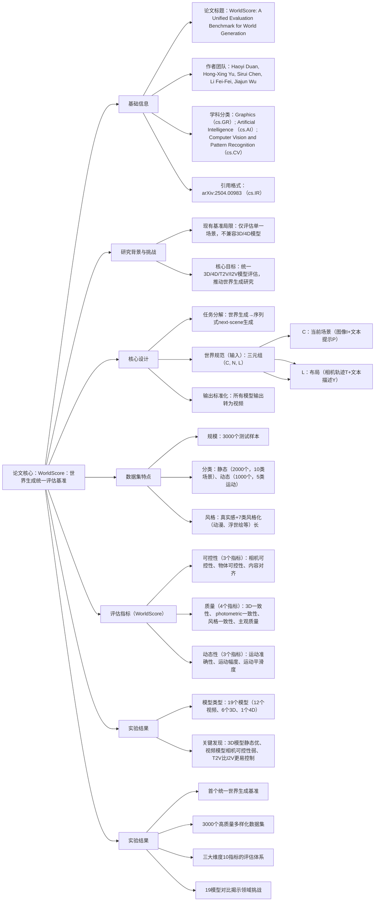

### 1. 一段话总结
李飞飞团队提出**WorldScore**——首个用于世界生成（World Generation）的统一评估基准，通过将世界生成分解为一系列“下一场景生成（next-scene generation）”任务，以“当前场景+下一场景+布局”的三元组规范统一输入（支持图像/文本提示、相机轨迹）与输出（标准化为视频），实现对3D/4D场景生成、文本到视频（T2V）、图像到视频（I2V）等19类模型的横向对比；该基准包含**3000个测试样本**（静态2000个、动态1000个，覆盖室内/室外、真实感/风格化场景），并从**可控性、质量、动态性**三大维度设计10个量化指标计算WorldScore；实验显示，3D场景生成模型（如WonderWorld，静态得分72.69）在静态世界生成中显著优于视频模型，而视频模型普遍存在**相机可控性不足**（最优视频模型CogVideoX-T2V相机可控性仅40.22）、长序列生成能力弱等问题，为世界生成领域提供了标准化评估工具与研究方向。

---

### 2. 思维导图

---

### 3. 详细总结
#### 1. 引言：研究背景与动机
现有视觉生成技术（视频、3D/4D场景生成）已能生成高质量单一场景，但世界生成需整合多场景且支持空间布局控制，而当前基准存在两大局限：
- 仅聚焦单一场景评估（如VBench仅评估T2V单场景质量），缺乏多场景整合能力；
- 不兼容3D/4D模型（需相机轨迹输入，现有基准无相关设计）。  
  为此，团队提出**WorldScore**，旨在建立统一评估框架，覆盖3D/4D/T2V/I2V等所有世界生成模型。

#### 2. 相关工作：现有基准与模型对比
| 对比维度         | 现有视频基准（如VBench） | WorldScore |
|------------------|--------------------------|------------|
| 评估场景         | 单一场景                 | 多场景序列 |
| 支持模型类型     | 仅视频模型               | 3D/4D/T2V/I2V |
| 相机轨迹输入     | ❌ 不支持                | ✅ 支持（含相机矩阵） |
| 风格化场景评估   | ❌ 有限                  | ✅ 7类风格化 |
| 动态性评估       | 仅基础运动               | 5类运动+3个动态指标 |

现有模型分为三类：
- 视频生成：T2V（如VideoCrafter1）、I2V（如DynamiCrafter），部分为闭源（如Gen-3、Hailuo）；
- 3D场景生成：依赖扩散模型（如LucidDreamer、WonderWorld）；
- 4D场景生成：整合动态信息（如4D-fy，开源但性能较弱）。

#### 3. WorldScore基准设计
##### 3.1 世界规范（World Specification）
- 任务形式：将世界生成分解为`(C, N, L)`三元组驱动的next-scene生成序列，其中：
    - **C（当前场景）**：图像I（真实感/风格化）+ 文本提示P（描述场景内容）；
    - **N（下一场景）**：文本提示，支持“小世界”（1个新场景）和“大世界”（3个新场景）；
    - **L（布局）**：8类相机运动（如平移、旋转，覆盖电影常用轨迹）+ 相机矩阵T（供3D/4D模型使用）。
- 输入适配：通过`w_proc`预处理模块，为不同模型提供适配输入（如T2V模型仅获文本，3D模型获相机矩阵）。

##### 3.2 数据集构建（3000个样本）
| 场景类型 | 子分类                | 样本量 | 风格类型       | 核心特点                  |
|----------|-----------------------|--------|----------------|---------------------------|
| 静态世界 | 室内（5类：餐厅、客厅等） | 1000个 | 真实感+风格化 | 评估可控性、质量          |
|          | 室外（5类：城市、郊区等） | 1000个 | 真实感+风格化 | 序列长度可变（1-3个场景） |
| 动态世界 | 5类运动（刚体、流体等）  | 1000个 | 真实感+风格化 | 固定相机，评估动态性      |
- 数据来源：真实图像（Unsplash）+ 合成数据集（如Matterport3D），经质量/视角/相似度筛选；
- 风格化：为每个真实感样本生成7类风格化版本（动漫、浮世绘、印象派等）。

##### 3.3 评估指标（WorldScore计算）
WorldScore分两类：`WorldScore-Static`（仅静态）、`WorldScore-Dynamic`（静态+动态），均通过10个指标线性归一化（0-100分）后平均得到：

| 评估维度 | 具体指标                | 计算逻辑                                                                 |
|----------|-------------------------|--------------------------------------------------------------------------|
| 可控性   | 相机可控性              | 计算生成视频与真实相机轨迹的旋转/平移误差（公式：\(e_{camera}=\sqrt{e_{\theta} \cdot e_{t}}\)） |
|          | 物体可控性              | 用Grounding DINO检测下一场景提示中的物体，计算成功率                     |
|          | 内容对齐                | 用CLIPScore衡量生成场景与文本提示的匹配度                                 |
| 质量     | 3D一致性                | 用DROID-SLAM计算帧间重投影误差，评估几何稳定性                           |
|          | Photometric一致性       | 计算光流端点误差（AEPE），评估纹理/外观稳定性                            |
|          | 风格一致性              | 比较首帧与末帧Gram矩阵差异，评估风格稳定性                               |
|          | 主观质量                | 融合CLIP-IQA+与CLIP Aesthetic（与人类偏好一致性最高，达0.637）           |
| 动态性   | 运动准确性              | 比较运动区域与非运动区域的光流最大值，评估运动是否符合提示               |
|          | 运动幅度                | 光流中位数，评估运动强度                                                 |
|          | 运动平滑度              | 用视频插值模型重建帧，计算MSE/SSIM/LPIPS，评估时序流畅性                 |

#### 4. 实验结果与关键发现
##### 4.1 模型评估概况（19个模型）
| 模型类型       | 代表模型          | WorldScore-Static | 核心优势                  | 核心不足                  |
|----------------|-------------------|-------------------|---------------------------|---------------------------|
| 3D场景生成     | WonderWorld       | 72.69             | 相机可控性高（92.98）、3D一致性强 | 无动态生成能力            |
|                | LucidDreamer      | 70.40             | 风格一致性优（88.71）     | 主观质量较低              |
| 视频生成（I2V）| CogVideoX-I2V     | 62.15             | 主观质量高（65.60）       | 相机可控性弱（38.27）     |
| 视频生成（T2V）| CogVideoX-T2V     | 55.31             | 运动幅度大（42.19）       | 物体可控性低（24.84）     |
| 4D场景生成     | 4D-fy             | 27.98             | 支持动态生成              | 3D一致性差（1.59）        |

##### 4.2 关键发现
1. **3D模型主导静态生成**：3D模型的相机可控性（均>80）、3D一致性（均>85）显著优于视频模型（相机可控性最高40.22）；
2. **视频模型可控性瓶颈**：即使最优视频模型，也难以遵循相机轨迹，需引入相机条件注入技术（如CameraCtrl）；
3. **开源与闭源视频模型差距缩小**：CogVideoX-I2V（开源）的静态得分（62.15）超过闭源模型Gen-3（60.71）、Hailuo（57.55）；
4. **动态生成trade-off**：运动幅度大的模型（如T2V-Turbo）往往运动平滑度低（20.54），需平衡强度与流畅性；
5. **场景类型影响显著**：视频模型在室内场景表现较好，室外场景得分比3D模型低30%以上。

#### 5. 结论与贡献
- **四大贡献**：
    1. 提出首个统一世界生成基准，覆盖多模型类型；
    2. 构建3000个高质量多样化数据集；
    3. 设计三大维度10指标的评估体系；
    4. 19模型对比揭示领域挑战（如3D转4D难、视频模型可控性弱）。
- **未来方向**：桥接3D与4D表示、提升视频模型可控性、优化长序列生成能力。

---

### 4. 关键问题与答案
#### 问题1：WorldScore如何解决不同类型世界生成模型（3D/4D/视频）的评估兼容性问题？
**答案**：通过“任务分解+输入输出标准化”实现兼容性：
1. **任务分解**：将世界生成拆解为序列式“next-scene生成”，每个步骤用`(C, N, L)`三元组统一定义，避免单一场景评估的局限；
2. **输入适配**：为不同模型提供定制化输入（如3D/4D模型获相机矩阵T，视频模型获文本描述Y），通过`w_proc`预处理模块转换格式；
3. **输出标准化**：要求所有模型输出转为视频（3D/4D模型渲染为视频，视频模型直接输出视频），确保评估对象统一；
4. **指标通用**：10个量化指标（如相机可控性、3D一致性）均基于视频帧计算，无需针对模型类型调整，实现横向对比。

#### 问题2：WorldScore数据集的设计特点如何支撑对“世界生成”能力的全面评估？
**答案**：数据集通过“规模+多样性+任务适配”支撑全面评估：
1. **规模与分类**：3000个样本涵盖静态（2000个，10类场景）与动态（1000个，5类运动），分别对应“多场景整合”与“动态交互”两大世界生成核心需求；
2. **场景多样性**：室内（餐厅、客厅等）+ 室外（城市、郊区等），覆盖真实世界常见环境，避免模型过拟合单一场景；
3. **风格多样性**：每个样本包含真实感与7类风格化版本（动漫、浮世绘等），评估模型在不同视觉域的泛化能力；
4. **任务适配**：静态场景支持“小世界”（1个新场景）和“大世界”（3个新场景），评估模型长序列生成能力；动态场景固定相机位置，聚焦运动准确性评估，避免相机运动干扰。

#### 问题3：实验中3D场景生成模型与视频模型的核心性能差异是什么？背后的技术原因是什么？
**答案**：核心差异集中在**静态世界生成能力**，技术根源在于模型对“空间结构”的表征方式：
1. **核心性能差异**：
    - 3D模型静态得分显著更高（WonderWorld 72.69 vs 最优视频模型CogVideoX-I2V 62.15）；
    - 关键指标差距：相机可控性（3D模型>80 vs 视频模型<45）、3D一致性（3D模型>85 vs 视频模型<60）；
    - 视频模型优势仅在动态生成（如运动幅度），但动态准确性仍不足。
2. **技术原因**：
    - 3D模型：基于三维空间表征（如高斯泼溅、NeRF），天生具备相机轨迹控制能力，可通过深度估计保证几何一致性；
    - 视频模型：基于2D帧序列生成，依赖时序建模（如扩散模型），缺乏显式空间结构约束，易出现相机轨迹偏移、纹理闪烁等问题，难以满足多场景整合的空间一致性需求。