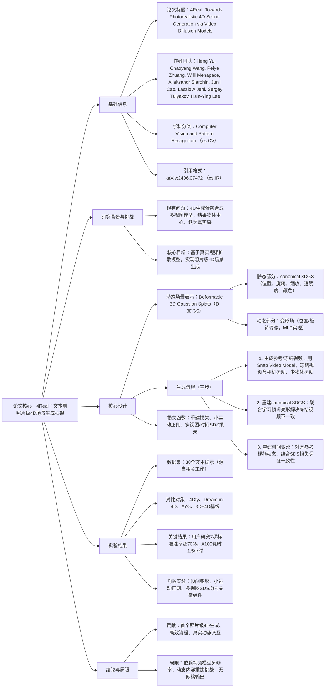

### 1. 一段话总结
Snap Inc.与卡内基梅隆大学团队提出**4Real**——首个基于视频扩散模型实现**照片级真实感文本到4D场景生成**的框架，其核心是摒弃传统依赖合成多视图模型的思路，转而利用训练于真实世界数据集的**文本-视频扩散模型**，通过**可变形3D高斯泼溅（D-3DGS）** 表示动态场景；该框架分三步实现：首先生成含动态内容的**参考视频**与含相机运动的**冻结视频（freeze-time video）**，再从冻结视频中联合学习** canonical 3DGS（规范3D高斯表示）** 与帧间变形以解决几何不一致，最后基于参考视频重建**时间变形**以捕捉动态交互；实验表明，4Real在**7项评估标准**中均优于4Dfy和Dream-in-4D（用户研究胜率超70%），且在A100 GPU上生成2秒4D场景仅需**1.5小时**，远快于同类方法的10+小时。

---

### 2. 思维导图

---

### 3. 详细总结
#### 1. 引言：研究背景与动机
现有4D场景生成方法因依赖**合成多视图模型**（训练于静态物体数据集），存在两大局限：
- 生成结果以**物体为中心**，缺乏环境交互与照片级真实感；
- 计算成本高（同类方法需10+小时/场景），难以实用化。  
  为此，团队提出**4Real**，核心思路是利用训练于大规模真实视频的**文本-视频扩散模型**，将4D生成转化为“视频生成+3D重建”问题，实现高效、高真实感的动态场景生成。

#### 2. 相关工作：现有方法对比
| 方法类型       | 核心依赖                | 真实感 | 效率（A100） | 多视角支持 |
|----------------|-------------------------|--------|--------------|------------|
| 4Dfy [2]       | 多视图扩散模型+NeRF     | 低     | 10+小时      | ✅          |
| Dream-in-4D [72]| 多视图+视频扩散模型     | 较低   | 10+小时      | ✅          |
| AYG [29]       | 动态3D高斯+合成数据     | 中等   | 8+小时       | ✅          |
| **4Real（本文）** | 真实视频扩散模型+D-3DGS | 照片级 | **1.5小时**  | ✅          |

#### 3. 核心方法：4Real框架设计
##### 3.1 动态场景表示：Deformable 3D Gaussian Splats（D-3DGS）
D-3DGS是4Real的核心表示方式，兼顾渲染效率与动态建模能力，由两部分组成：
- **Canonical 3DGS**：静态3D场景基础，每个高斯点包含：
    - 位置（$`(x \in \mathbb{R}^3)`$）、旋转（四元数$`(q \in \mathbb{R}^4)`$）、缩放（$`(s \in \mathbb{R}^3)`$）；
    - 透明度（$`(\alpha)`$）、颜色（$`(c \in \mathbb{R}^3)`$）。
- **变形场**：建模动态运动，用MLP输出每个时间步的偏移：
    - 位置偏移$`(\Delta x_t)`$、旋转偏移$`(\Delta q_t)`$，最终状态为$`(x_t = x + \Delta x_t)`$、$`(q_t = q + \Delta q_t)`$。

##### 3.2 核心流程（三步法）
| 步骤                | 目标                                  | 关键操作                                                                                                                         |
|---------------------|---------------------------------------|------------------------------------------------------------------------------------------------------------------------------|
| 1. 生成参考/冻结视频 | 获取动态目标与多视角静态信息          | - 参考视频：用Snap Video Model生成含动态内容的视频（如“熊猫玩牌”）； - 冻结视频：通过提示工程（加“相机环绕”“时间流逝”）生成含相机运动、少物体运动的视频，迭代扩展视角至180°。                    |
| 2. 重建Canonical 3DGS | 获得静态3D基础，解决冻结视频不一致    | - 联合优化：将冻结视频的几何不一致视为“帧间变形”，与canonical 3DGS共同学习； - 损失函数：重建损失（$`(L_{recon})`$）、小运动正则（$`(L_{small\ mo.})`$）、多视图SDS损失（$`(L_{SDS})`$）。 |
| 3. 重建时间变形     | 对齐参考视频动态，保证多视角一致性    | - 对齐损失：像素损失+SSIM损失（$`(L_{align})`$）； - 正则化：空间/时间平滑损失（如局部刚性损失$`(L_{rigid})`$）； - 联合SDS：同时用固定视角视频（保证时间一致）和冻结视频（保证多视图一致）优化。 |

##### 3.3 关键损失函数
| 损失类型          | 作用                                  | 计算逻辑                                                               |
|-------------------|---------------------------------------|----------------------------------------------------------------------|
| 重建损失（$`(L_{recon})`$） | 匹配生成帧与真实帧                    | 计算D-3DGS渲染帧与冻结/参考视频帧的L1距离                                 |
| 小运动正则（$`(L_{small\ mo.})`$） | 限制变形幅度，避免过度拟合            | 对帧间偏移$`(\Delta x_k)`$和$`(\Delta q_k)`$求和L1范数                        |
| SDS损失（$`(L_{SDS})`$） | 对齐真实视频分布，提升真实感          | 对渲染帧加噪声，用视频扩散模型去噪后，计算渲染帧与去噪帧的平方差          |

#### 4. 实验验证
##### 4.1 实验设置
- **测试数据**：30个文本提示（源自[2,35,72]），覆盖复杂光照、半透明物体、多物体场景；
- **对比模型**：4Dfy [2]、Dream-in-4D [72]、AYG [29]、3D场景+4D物体基线；
- **硬件**：单张NVIDIA A100 GPU（80GB）。

##### 4.2 定量对比（X-CLIP与VideoScore）
| 模型          | X-CLIP  | Visual Quality | Temporal Consistency | Dynamic Degree | T-V Alignment | Factual Consistency |
|---------------|---------|----------------|----------------------|----------------|---------------|--------------------|
| 4Dfy [2]      | 20.03   | 1.43           | 1.49                 | 3.05           | 2.26          | 1.30               |
| Dream-in-4D [72] | 19.52 | 1.34           | 1.37                 | 3.02           | 2.27          | 1.20               |
| AYG [29]      | 19.87   | 2.44           | 2.09                 | 3.15           | 2.80          | 2.47               |
| **4Real（本文）** | **24.23** | **2.43**    | **2.17**            | **3.15**       | **2.91**      | **2.49**           |

##### 4.3 用户研究结果
在Amazon Turk开展用户研究，30名评估者/视频对，基于7项标准对比4Real与4Dfy、Dream-in-4D，结果如下：  
| 评估标准                | 4Real vs 4Dfy 胜率 | 4Real vs Dream-in-4D 胜率 |
|-------------------------|-------------------|--------------------------|
| 运动真实感（Motion Realism） | 77.1%             | 73.3%                    |
| 前景真实感（Foreground Photo-Realism） | 76.3%         | 72.5%                    |
| 背景真实感（Background Photo-Realism） | 74.2%         | 71.8%                    |
| 3D形状真实感（3D Shape Realism） | 73.9%         | 70.6%                    |
| 整体真实感（General Realism） | 75.8%             | 72.1%                    |
| 动态程度（Significance of Motion） | 71.5%         | 69.7%                    |
| 文本-视频对齐（T-V Alignment） | 74.6%             | 73.0%                    |

##### 4.4 消融实验关键结论
| 移除组件                | 影响                                  | 典型现象                                                                 |
|-------------------------|---------------------------------------|--------------------------------------------------------------------------|
| 帧间变形（Per-frame Deform） | 几何不一致严重， artifacts 增多        | 熊猫面部模糊、厨房门边界错位                                             |
| 小运动正则（Small Motion Reg） | 过度拟合冻结视频，重建噪声大          | 背景出现无意义抖动                                                       |
| 多视图SDS（Multi-view SDS） | 形状真实感下降，细节丢失              | 人体头部轮廓模糊、沙发上边界不清晰                                       |

#### 5. 讨论与结论
##### 5.1 核心贡献
1. 提出首个**照片级文本到4D场景生成框架**，摒弃合成多视图模型依赖；
2. 设计高效流程，A100生成2秒4D场景仅需**1.5小时**，较同类方法提速6倍+；
3. 验证D-3DGS在动态场景建模的有效性，支持多视角自由观察。

##### 5.2 局限
1. 依赖视频扩散模型的分辨率与动态控制能力，快速运动时易出现模糊；
2. 难以处理物体突然出现/消失、光照突变等极端动态场景；
3. 仅输出高斯表示，无法生成高质量网格（Mesh）。

---

### 4. 关键问题
#### 问题1：4Real如何解决现有4D生成方法“缺乏照片级真实感”的核心痛点？
**答案**：现有方法因依赖训练于合成物体数据集的**多视图模型**，生成结果偏向“物体中心”且真实感低；4Real通过两大设计突破：
1. **数据来源革新**：摒弃多视图模型，转而使用训练于**大规模真实世界视频**的Snap Video Model，其覆盖更丰富的外观、形状、物体-环境交互模式；
2. **表示与流程优化**：采用**D-3DGS**作为动态场景表示，兼顾渲染保真度与效率；流程中通过“冻结视频+多视图SDS”保证几何一致性，“参考视频+时间SDS”保证动态真实感，最终生成结果在用户研究的“前景/背景真实感”指标上胜率超72%，X-CLIP分数达24.23（较4Dfy的20.03提升21%）。

#### 问题2：“冻结视频（freeze-time video）”在4Real流程中扮演什么角色？如何处理其不可避免的几何不一致问题？
**答案**：
- **核心作用**：为重建**canonical 3DGS**提供多视角静态信息——通过提示工程（如“相机环绕”“时间流逝”）生成含大范围相机运动、少物体运动的视频，帮助模型学习场景的3D几何结构，而非仅依赖单帧；
- **处理不一致的方法**：由于视频模型能力限制，冻结视频仍可能存在几何不一致（如帧间物体位置偏移），4Real将其视为“帧间变形”（per-frame deformation），通过**联合优化**解决：
    1. 引入变形场$`(w_{multi-view}`$)，建模每个帧相对于canonical帧的位置/旋转偏移；
    2. 同时优化canonical 3DGS参数与变形场，损失函数包含“重建损失”（匹配冻结视频帧）和“小运动正则”（限制偏移幅度，避免过度拟合）；
    3. 后期加入**多视图SDS损失**，用视频扩散模型的真实分布约束canonical 3DGS，进一步修正几何不一致。

#### 问题3：4Real在“效率”上的优势具体体现在哪些实验数据？与同类方法的效率差距为何显著？
**答案**：
- **效率数据**：4Real在单张A100 GPU上生成2秒4D场景仅需**1.5小时**，而同类方法（4Dfy、Dream-in-4D）需10+小时，效率提升6倍以上；
- **差距原因**：
    1. **SDS实现优化**：仅使用视频扩散模型的**低分辨率阶段**（36×64）计算SDS损失，避免高分辨率阶段的高计算消耗，单步SDS耗时从2秒（SVD模型）降至200毫秒（Snap Video Model）；
    2. **流程简化**：将4D生成转化为“视频生成+3D重建”，无需传统方法的多轮多视图采样与优化；
    3. **内存效率**：Snap Video Model采用压缩Transformer架构，支持16帧批量梯度计算，而同类模型（如SVD）因内存限制仅能处理4帧，并行效率提升4倍。