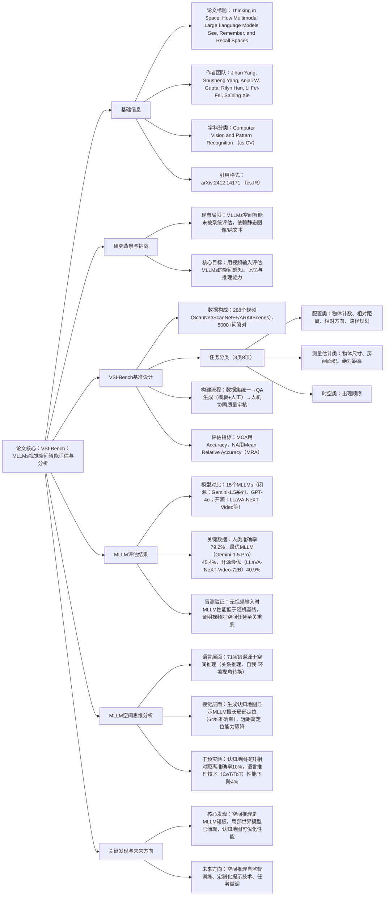

### 1. 一段话总结
李飞飞团队（纽约大学、斯坦福大学等）提出**VSI-Bench**——首个包含**5000+问答对、288个真实室内场景视频**的视频视觉空间智能基准，用于评估多模态大语言模型（MLLMs）的空间认知能力；实验显示，MLLMs（如Gemini-1.5 Pro、GPT-4o）展现出**有竞争力但低于人类**的视觉空间智能（人类平均准确率79.2%，最优MLLM仅45.4%），且存在显著瓶颈：**空间推理（占71%错误）** 是核心短板，传统语言推理技术（CoT、ToT）不仅无效还会降低性能；进一步分析发现，MLLMs能构建**局部世界模型**（相邻物体定位准确率64%）但缺乏全局连贯认知，而通过生成**认知地图**可将相对距离推理准确率提升10%，为提升MLLMs空间智能提供关键方向。

---

### 2. 思维导图

---

### 3. 详细总结
#### 一、研究背景：为何需要评估MLLMs的视觉空间智能？
人类具备通过连续视觉观察构建空间记忆的能力（如回忆客厅布局），而MLLMs虽在语言和通用视觉任务中表现突出，但**空间智能（感知、记忆、推理空间关系）** 仍未被系统评估：
- 现有基准局限：多依赖静态图像或纯文本，缺乏视频输入（无法模拟人类连续观察）；
- 实际需求：空间智能是机器人、自动驾驶、AR/VR等领域的核心能力，需明确MLLMs的空间认知边界。

#### 二、VSI-Bench：视频视觉空间智能基准设计
VSI-Bench是首个以**真实室内场景视频**为输入的空间智能评估基准，核心设计如下：

| 设计维度       | 具体内容                                                                 |
|----------------|--------------------------------------------------------------------------|
| 数据来源       | 3个公开3D重建数据集：ScanNet（88个视频）、ScanNet++（50个）、ARKitScenes（150个） |
| 数据规模       | 288个视频（时长0-300秒）、5000+问答对                                    |
| 任务类型（3类8项） | 1. 配置类：物体计数、相对距离、相对方向、路径规划 2. 测量估计类：物体尺寸、房间面积、绝对距离 3. 时空类：出现顺序 |
| 评估指标       | - 多选题（MCA）：Accuracy（精确匹配） - 数值题（NA）：MRA（多阈值相对准确率平均） |
| 质量保障       | 人机协同审核：过滤模糊QA、修正源数据集标注错误，迭代优化至符合质量标准       |

**基准创新点**：
1. 以视频为输入，更贴近人类空间认知方式；
2. 覆盖“感知-记忆-推理”全链条空间任务；
3. 提供人类性能基线（79.2%），明确MLLM与人类的差距。

#### 三、MLLM评估实验：核心结果与对比
##### 3.1 模型性能排名（Top 5）
| 模型类型       | 模型名称                | 平均准确率 | 数值题表现 | 多选题表现 | 关键优势                  |
|----------------|-------------------------|------------|------------|------------|---------------------------|
| 闭源模型       | Gemini-1.5 Pro          | 45.4%      | 56.2%      | 46.3%      | 绝对距离、房间面积估计最优 |
| 开源模型       | LLaVA-NeXT-Video-72B    | 40.9%      | 48.9%      | 36.7%      | 开源中综合性能最强        |
| 开源模型       | LLaVA-OneVision-72B     | 40.2%      | 43.5%      | 39.9%      | 物体尺寸估计突出          |
| 闭源模型       | Gemini-1.5 Flash        | 42.1%      | 49.8%      | 41.0%      | 时空任务（出现顺序）最优  |
| 闭源模型       | GPT-4o                  | 34.0%      | 46.2%      | 41.3%      | 相对方向推理略优          |

##### 3.2 关键发现
1. **人机差距显著**：人类平均准确率79.2%，最优MLLM（Gemini-1.5 Pro）仅45.4%，尤其在路径规划（人类100% vs MLLM 34.6%）、相对方向（人类95.8% vs MLLM 36.0%）任务中差距最大；
2. **视频输入不可或缺**：无视频时（盲测），MLLM性能普遍低于随机基线（如绝对距离任务准确率<5%），证明视觉信号对空间任务的必要性；
3. **开源模型逼近闭源**：LLaVA-NeXT-Video-72B（40.9%）仅比Gemini-1.5 Pro低4.5%，但多数开源模型（7/12）性能低于基线，存在明显分化。

#### 四、MLLM空间思维分析：为何表现不佳？
通过“语言自我解释”和“视觉认知地图”双维度分析，定位核心问题：

##### 4.1 语言层面：错误类型拆解
对Gemini-1.5 Pro的163个错误案例手动分类，发现：
- **空间推理错误（71%）**：含关系推理（距离/方向判断错误）和自我-环境视角转换错误（如混淆“面向沙发时的左右”）；
- 视觉感知错误（12%）：物体识别错误（如误将梳妆台认作桌子）；
- 语言智能错误（9%）：数学计算、指令理解偏差；
- 时序处理错误（8%）：视频帧顺序判断错误。

**关键结论**：**空间推理是MLLM的核心短板**，而非视觉感知或语言能力。

##### 4.2 视觉层面：认知地图的局限性
让Gemini-1.5 Pro生成10×10网格的认知地图（标注物体位置），发现：
- **局部优势**：相邻物体（距离<2网格单位）定位准确率64%；
- **全局缺陷**：物体距离越远，准确率骤降（距离>8网格单位时准确率<10%），证明MLLM构建的是**局部世界模型**，而非全局连贯认知；
- **认知地图的价值**：生成认知地图后，MLLM相对距离推理准确率从46.0%提升至56.0%（使用Ground Truth认知地图时达66.0%）。

##### 4.3 语言推理技术的无效性
测试CoT（思维链）、Self-Consistency、ToT（思维树）等主流语言推理技术，结果均为**性能下降**：
- Zero-Shot CoT：平均准确率降低4%；
- ToT：房间面积、物体尺寸任务性能下降8%-21%；
- 原因：空间推理依赖视觉-空间表征，纯语言逻辑无法弥补空间认知缺陷。

#### 五、结论与未来方向
##### 5.1 核心贡献
1. 提出首个视频驱动的视觉空间智能基准VSI-Bench；
2. 量化MLLM空间智能水平，明确“空间推理”为核心瓶颈；
3. 发现MLLM的局部世界模型特性，验证认知地图对空间推理的优化作用。

##### 5.2 局限与未来方向
- 局限：仅覆盖室内场景，未涉及动态物体交互、室外复杂环境；
- 未来方向：
  1. 设计空间推理专用自监督训练目标；
  2. 开发视觉-空间定制化提示技术（而非纯语言提示）；
  3. 通过任务微调增强MLLM的全局空间认知能力。

---

### 4. 关键问题
#### 问题1：VSI-Bench与现有MLLM评估基准相比，核心创新点是什么？
**答案**：现有基准（如Video-MME、EgoSchema）多聚焦视频内容理解（如物体识别、动作分类），缺乏对“空间认知”的系统评估；VSI-Bench的核心创新的在于：
1. **输入形式**：以真实室内场景视频为输入，模拟人类连续观察空间的方式，而非静态图像或纯文本；
2. **任务设计**：覆盖“感知（物体计数）-记忆（出现顺序）-推理（路径规划、距离估计）”全链条空间任务，而非单一内容理解；
3. **评估维度**：首次引入“自我-环境视角转换”“全局空间连贯”等空间认知特有的评估维度，并提供人类性能基线（79.2%），明确MLLM与人类的差距；
4. **指标适配**：针对数值类空间任务（如物体尺寸、房间面积）设计Mean Relative Accuracy（MRA），解决传统Accuracy无法衡量连续数值接近度的问题。

#### 问题2：MLLMs在视觉空间任务中表现不佳的核心原因是什么？如何验证这一结论？
**答案**：核心原因是**空间推理能力不足**，而非视觉感知或语言理解能力，验证方式如下：
1. **错误类型拆解**：对Gemini-1.5 Pro的163个错误案例手动分类，发现71%的错误源于空间推理（如“面向冰箱时判断水壶位置错误”“估算房间面积时混淆地板砖尺寸”），仅12%源于视觉感知（物体识别错误）、9%源于语言智能（数学计算偏差）；
2. **语言推理技术无效性**：测试CoT、ToT等纯语言推理技术，结果显示这些方法不仅无法提升性能，还使部分任务（如房间面积估计）准确率下降21%，证明纯语言逻辑无法弥补空间认知缺陷；
3. **认知地图分析**：MLLM能准确定位相邻物体（64%准确率），但远距离物体定位准确率骤降（<10%），说明其缺乏全局空间推理能力，仅能构建局部世界模型。

#### 问题3：生成“认知地图”为何能提升MLLMs的空间推理能力？这一发现对未来MLLM优化有何启示？
**答案**：
1. **认知地图的作用机制**：认知地图是MLLM空间表征的“可视化外显”，其核心价值在于：
  - 强制MLLM构建“物体-位置”的全局关联，弥补局部世界模型的缺陷；
  - 提供空间拓扑约束（如“沙发在茶几左侧”），减少推理时的随机偏差；  
    实验显示，生成认知地图后，MLLM相对距离推理准确率从46.0%提升至56.0%，使用Ground Truth认知地图时进一步提升至66.0%。

2. **对未来优化的启示**：
  - **训练层面**：可将“生成认知地图”作为MLLM空间智能的预训练任务，强制模型学习全局空间关联；
  - **推理层面**：在空间任务中引入“认知地图生成-基于地图推理”的两阶段流程，而非直接输出答案；
  - **模型设计层面**：需融合视觉-空间表征模块（如3D高斯泼溅、NeRF），而非仅依赖语言或2D视觉特征，从根本上提升空间推理能力。