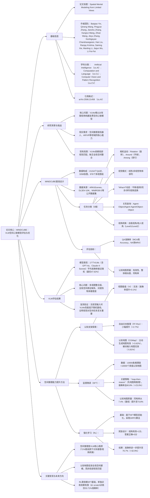

### 1. 一段话总结
李飞飞团队联合西北大学、斯坦福大学等提出**MINDCUBE**——首个用于评估视觉语言模型（VLMs）从有限视角构建**空间心智模型**的基准，包含**21154个问答对、3268张图像、976个多视图组**，覆盖旋转（Rotation）、环绕（Around）、穿行（Among）3类视角变换与5维任务分类；实验发现现有VLMs（如GPT-4o、Claude-4-Sonnet）空间推理能力接近随机（最优模型准确率仅47.62%），核心瓶颈是难以整合多视图信息构建全局空间表征；通过“**map-then-reason**”协同策略（先生成认知地图再推理），结合**监督微调（SFT）**（认知地图同构率从7.4%提升至73.8%）与**强化学习（RL）**，最终将VLMs空间推理准确率从**37.8%提升至70.7%**，证明主动构建结构化空间表征是提升VLM空间智能的关键。

---

### 2. 思维导图

---

### 3. 详细总结
#### 一、研究背景：为何关注VLM的空间心智模型？
人类能从有限视角快速构建**空间心智模型**（如通过房间局部视图推断整体布局），但现有视觉语言模型（VLMs）存在两大局限：
1. **多视图整合能力弱**：难以将离散视角信息整合为全局空间表征；
2. **遮挡推理差**：对未直接可见的物体（如家具后的物品）无法有效推断；
3. **动态视角适应差**：无法处理“假设旋转/移动后”的空间关系变化（“What-if”场景）。  
   为此，团队提出**MINDCUBE基准**，并探索提升VLM空间推理能力的方法。

#### 二、MINDCUBE基准：设计与构成
MINDCUBE是首个聚焦“有限视角空间推理”的基准，核心设计如下：

##### 2.1 基准构成与数据来源
| 维度         | 具体内容                                                                 |
|--------------|--------------------------------------------------------------------------|
| 数据规模     | 21154个问答对（QA）、3268张图像、976个多视图组                          |
| 数据来源     | 公开3D数据集（ARKitScenes、DL3DV-10K、WildRGB-D）+ 自采集数据           |
| 视角变换类型 | 3类：Rotation（相机固定旋转，1081个QA）、Among（穿行物体间，18204个QA）、Around（环绕物体，1869个QA） |
| 标注流程     | 图像筛选→空间信息标注→模板化QA生成→人机协同质量审核（过滤模糊/错误标注） |

##### 2.2 任务分类与评估指标
- **任务分类（5维 taxonomy）**：覆盖空间推理全链条，示例如下：  
  | 维度         | 示例类别                          | 任务示例                                  |
  |--------------|-----------------------------------|-------------------------------------------|
  | 相机运动     | Around（环绕）                    | “环绕桌子移动时，左侧是否有椅子？”          |
  | 视觉模式     | 非线性排列                        | “从视角1看，沙发、茶几、电视是否呈L型排列？” |
  | “What-if”动态 | 旋转+平移（sequence）             | “从视角2左转90度再前进，是否靠近冰箱？”      |
  | 关系查询     | Object-Object                     | “茶几到电视的距离是多少米？”              |
  | 视角转换     | 他人视角（Level2）                | “从沙发视角看，台灯在左侧还是右侧？”        |

- **评估指标**：
    1. **QA性能**：多选题（MCA）用**Accuracy**，数值题（NA）用**Mean Relative Accuracy（MRA）**（多阈值相对误差平均）；
    2. **认知地图质量**：
        - 有效性（Valid Rate）：生成地图是否符合JSON格式与空间逻辑；
        - 整体相似度（Overall Similarity）：融合方向一致性（70%权重）与朝向一致性（30%权重）；
        - 同构率（Isomorphic Rate）：生成地图与真值的物体 pairwise 关系匹配度（旋转不变）。

#### 三、VLM评估结果：空间推理能力薄弱
对17个主流VLMs（含闭源如GPT-4o、Claude-4-Sonnet，开源如LLaVA-OneVision、InternVL2.5）的评估显示：

##### 3.1 模型性能概况
| 模型类型       | 代表模型                | 整体准确率 | Rotation任务 | Among任务 | Around任务 | 关键问题                          |
|----------------|-------------------------|------------|--------------|-----------|------------|-----------------------------------|
| 闭源模型       | Gemini-1.5 Pro          | 45.4%      | 48.42%       | 44.21%    | 47.62%     | 全局空间整合弱                    |
| 开源模型       | LLaVA-NeXT-Video-72B    | 40.9%      | 35.71%       | 57.4%     | 48.6%      | 遮挡物体推理差                    |
| 空间专用模型   | Spatial-MLLM            | 32.06%     | 38.39%       | 33.71%    | 26.32%     | 动态视角适应差                    |
| 随机基线（频率）| -                      | 33.02%     | 38.30%       | 32.66%    | 35.79%     | -                                 |

##### 3.2 核心问题诊断
1. **空间推理是主要瓶颈**：对Gemini-1.5 Pro的163个错误案例分析显示，71%错误源于**空间推理**（关系推理42%、视角转换29%），仅12%源于视觉感知、9%源于语言理解；
2. **局部依赖强，全局表征弱**：VLMs能定位相邻物体（认知地图局部准确率64%），但远距离物体定位准确率骤降（>8网格单位时<10%）；
3. **被动支架无效**：直接输入真值认知地图或插值视图，VLMs性能无提升甚至下降（如输入Aug-CGMap准确率降至32.0%）。

#### 四、提升策略：从认知支架到SFT+RL
通过“认知支架探索→监督微调（SFT）→强化学习（RL）”三步，显著提升VLM空间推理能力：

##### 4.1 认知支架：筛选有效空间引导方式
对比3类认知支架（模拟人类空间认知机制），仅“主动生成认知地图”有效：

| 认知支架类型       | 具体操作                          | 准确率变化 | 核心结论                          |
|--------------------|-----------------------------------|------------|-----------------------------------|
| 视图插值（VI）     | 插入1-2个中间视图                 | +0.09%     | 视觉连续性无法提升空间推理        |
| 自由文本推理（FF-Rsn）| 提示模型分步 verbalize 推理过程   | +2.7%      | 语言逻辑对空间任务帮助有限        |
| 认知地图（CGMap）   | 提示模型生成10×10网格物体布局     | +3.62%     | 主动构建空间表征是关键            |
| 被动输入CGMap      | 直接提供真值认知地图              | -5.81%     | 无推理参与的支架无效              |

##### 4.2 监督微调（SFT）：教VLMs构建空间表征
基于10000条真值推理链+10000个真值认知地图，设计5种SFT策略，**“map-then-reason”** 效果最优：

| SFT策略                | 整体准确率 | 认知地图同构率 | 关键提升                          |
|-------------------------|------------|----------------|-----------------------------------|
| Raw-QA（仅QA微调）      | 52.28%     | -              | 基础空间线索学习                  |
| FF-Rsn（仅推理链微调）  | 53.52%     | -              | 推理逻辑优化（+1.2%）             |
| Plain-CGMap-Out（仅地图）| 54.38%     | 89.05%         | 空间布局建模（+2.1%）             |
| **Plain-CGMap-FFR-Out** | **60.76%** | **73.81%**     | 地图+推理协同（+8.48%）           |

*注：Plain-CGMap（仅物体位置）优于Aug-CGMap（含相机视角），因额外视角信息增加生成误差，同构率从46%降至43.24%。*

##### 4.3 强化学习（RL）：进一步优化推理性能
以最优SFT模型（Plain-CGMap-FFR-Out）为初始化，采用**GRPO算法**与稀疏奖励（结构有效+1，答案正确+5）：

| RL策略                          | 整体准确率 | 认知地图同构率 | 较SFT提升 | 核心作用                          |
|---------------------------------|------------|----------------|------------|-----------------------------------|
| RL-FF-Rsn（从scratch）          | 50.57%     | -              | -10.19%    | 无SFT基础时，奖励无法引导空间建模  |
| RL-Plain-CGMap-FFR-Out（从scratch）| 53.71% | 10.29%         | -7.05%     | 缺乏先验空间表征，性能有限        |
| **RL-Plain-CGMap-FFR-Out（从SFT）** | **70.67%** | **71.52%**     | **+9.91%** | 优化SFT的空间推理精度，突破性能瓶颈 |

#### 五、关键发现与未来方向
1. **空间推理是VLM核心短板**：71%错误源于关系推理与视角转换，而非视觉感知或语言能力；
2. **“主动构建+推理”是最优路径**：被动输入空间信息无效，需让VLMs自主生成认知地图并基于其推理；
3. **RL需依赖SFT基础**：仅在SFT构建空间表征后，RL才能有效优化推理精度（提升9.91% vs 从scratch下降7.05%）；
4. 未来方向：探索空间推理自监督目标、动态环境适应、多模态空间融合（视觉+触觉）。

---

### 4. 关键问题
#### 问题1：MINDCUBE基准与现有VLM空间评估基准（如VSI-Bench）的核心创新点是什么？
**答案**：现有基准（如VSI-Bench）聚焦“静态场景空间问答”，而MINDCUBE的核心创新在于**针对“有限视角→全局空间心智模型”的能力评估**，具体体现在三方面：
1. **任务设计更贴近人类认知**：引入“ What-if 动态视角”（如“旋转后物体位置”）与“他人视角转换”（Level2视角），模拟人类对未观察空间的推理；
2. **数据更强调多视图连贯性**：976个多视图组均来自真实3D场景（如ARKitScenes），确保视角变换的空间一致性，而非孤立图像；
3. **评估维度更全面**：除QA准确率外，首次引入“认知地图质量指标”（同构率、相似度），量化VLM的空间表征能力，而非仅关注最终答案。

实验显示，现有VLM在MINDCUBE上表现接近随机（最优47.62% vs 人类94.55%），而VSI-Bench中最优VLM准确率达45.4%（接近MINDCUBE），但MINDCUBE更能暴露“全局空间整合”这一核心瓶颈。

#### 问题2：为何“生成认知地图+推理”（map-then-reason）策略能显著提升VLM空间推理能力？
**答案**：该策略解决了VLM空间推理的核心痛点——**缺乏全局空间表征**，具体机制如下：
1. **强制全局空间建模**：认知地图（10×10网格）要求VLM明确物体 pairwise 位置关系，而非依赖局部视觉匹配，实验中SFT后认知地图同构率从7.4%（基线）提升至73.8%，证明全局空间表征形成；
2. **推理引导空间表征优化**：仅生成地图时，VLM易学习“结构完美但功能无效”的地图（如Plain-CGMap-Out同构率89.05%但准确率仅54.38%），而结合推理后，VLM会优化地图以服务下游任务，如在“环绕物体”任务中，推理引导地图修正物体遮挡关系，准确率提升8.48%；
3. **适配VLM的多模态优势**：认知地图将空间信息转化为“视觉化语言结构”（JSON格式），契合VLM的图文融合能力，而纯文本推理无法提供具象空间约束，故效果有限（仅+2.7%）。

#### 问题3：强化学习（RL）在提升VLM空间推理中扮演什么角色？为何单独使用RL效果差？
**答案**：RL的核心角色是**优化SFT构建的空间表征与推理逻辑**，而非从零构建空间能力，具体如下：
1. **RL的作用**：在SFT基础上，通过稀疏奖励（答案正确+5分、地图有效+1分）微调模型的空间推理细节，如修正认知地图中物体位置偏差、优化“视角转换”时的推理步骤，最终将准确率从60.76%（SFT）提升至70.67%，且认知地图同构率保持71.52%（仅下降2.29%）；
2. **单独RL效果差的原因**：
    - 缺乏空间先验：从scratch训练时，VLM无法通过奖励学习“什么是合理的空间布局”，如RL-Plain-CGMap-FFR-Out（从scratch）的认知地图同构率仅10.29%，远低于SFT后的73.81%；
    - 奖励信号模糊：空间推理的“错误原因”难以通过稀疏奖励区分（如答案错误可能因地图不准或推理逻辑错），而SFT已通过真值数据教会VLM“正确的空间建模方式”，RL仅需微调细节即可。

实验证明，RL需与SFT协同：SFT构建“空间表征能力”，RL优化“表征的功能有效性”，二者结合才能实现32.9%的准确率提升（37.8%→70.7%）。