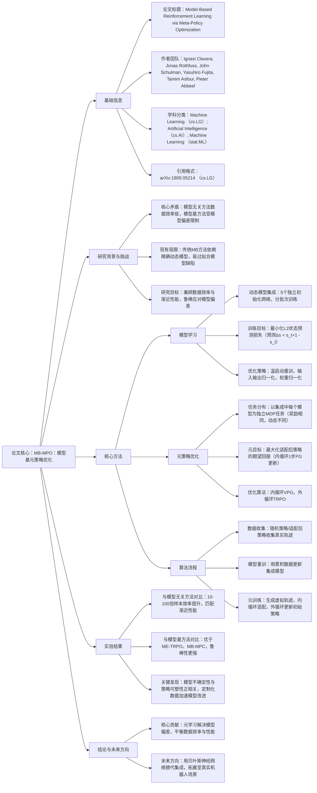

### 1. 一段话总结
本文提出**Model-Based Meta-Policy Optimization（MB-MPO）**，一种结合模型基强化学习与元学习的方法，旨在解决传统模型基方法依赖精确动态模型、易受**模型偏差（model-bias）** 影响的核心问题。其核心思路是：通过训练**动态模型集成**（而非单一模型），将策略优化构建为元学习问题——元训练一个初始策略，使其能通过**1步策略梯度更新**快速适配集成中的任意模型，从而内化模型间的一致动态信息，将模型差异的适配负担转移至内循环更新。实验表明，MB-MPO在Mujoco 6个连续控制任务中，能以**10-100倍更低的样本复杂度**匹配DDPG、PPO等模型无关方法的渐近性能，且在强模型偏差场景下仍能稳定学习，显著优于ME-TRPO等现有模型基方法。


---


### 2. 思维导图



---


### 3. 详细总结
#### 1. 引言：问题与动机
传统强化学习存在两大分支的局限：
- **模型无关（MF）方法**：如DDPG、PPO，能达到最优渐近性能，但**样本复杂度极高**（依赖大量真实环境数据），难以应用于机器人等真实场景；
- **模型基（MB）方法**：通过学习环境动态模型提升数据效率，但受**模型偏差（model-bias）** 影响——模型精度不足时，策略易过拟合模型缺陷，导致性能饱和且低于MF方法。

为此，本文提出**Model-Based Meta-Policy Optimization（MB-MPO）**，核心创新是**用元学习替代对单一精确模型的依赖**，通过动态模型集成与策略快速适配，平衡数据效率与鲁棒性。


#### 2. 相关工作
| 类别                | 核心思路                          | 局限                                  |
|---------------------|-----------------------------------|---------------------------------------|
| 模型基RL（抗模型偏差） | 用模型集成、鲁棒优化缓解偏差       | 策略保守，渐近性能低                  |
| 模型基+模型无关混合  | 用模型生成虚拟轨迹辅助MF训练       | 仍依赖大量真实数据，模型偏差未根本解决 |
| 元学习RL            | 学习可快速适配新任务的初始策略     | 任务多为奖励差异，未针对动态模型差异  |


#### 3. 背景知识
- **模型基RL**：通过参数化模型\(\hat{f}_{\phi}(s'|s,a)\)学习状态转移，训练目标为最小化预测损失，策略优化在虚拟轨迹上进行。
- **元学习RL（MAML）**：学习初始策略参数\(\theta^*\)，使仅需1-少数步梯度更新即可适配新任务，目标为最大化适配后策略的期望回报。


#### 4. 核心方法：MB-MPO
##### 4.1 动态模型集成学习
- **集成构建**：训练5个独立初始化的前馈神经网络，每个模型用随机采样的数据集子集\(D_k\)训练，减少模型相关性；
- **训练目标**：预测状态变化量\(\Delta s = s_{t+1} - s_t\)，最小化L2损失：  
  \[min _{\phi_{k}} \frac{1}{|D_{k}|} \sum_{(s_t,a_t,s_{t+1}) \in D_k}\| s_{t+1}-\hat{f}_{\phi_k}(s_t,a_t)\| _2^2\]
- **优化策略**：温启动重训（利用历史参数初始化）、输入输出归一化、权重归一化，避免过拟合。

##### 4.2 元策略优化
- **任务定义**：将集成中的每个动态模型\(\hat{f}_{\phi_k}\)视为独立MDP任务（奖励函数相同，动态不同），构建均匀任务分布；
- **元学习目标**：学习初始策略\(\theta\)，使其经1步策略梯度更新（内循环，学习率\(\alpha=0.001\)）后的适配策略\(\theta_k' = \theta + \alpha\nabla_\theta J_k(\theta)\)在任务k上的回报最大化：  
  \[max _{\theta} \frac{1}{K} \sum_{k=1}^{K} J_k(\theta_k')\]  
  其中\(J_k(\theta)\)为策略\(\pi_\theta\)在模型k上的期望回报；
- **优化算法**：内循环用 vanilla policy gradient（VPG），外循环用Trust-Region Policy Optimization（TRPO），降低梯度方差。

##### 4.3 算法流程（Algorithm 1）
1. 初始化：策略\(\pi_\theta\)、5个动态模型\(\hat{f}_{\phi_1...5}\)、数据缓冲区\(D=\emptyset\)；
2. 迭代：  
   a. 数据收集：用适配策略\(\pi_{\theta_k'}\)收集真实轨迹，加入\(D\)；  
   b. 模型重训：用\(D\)温启动训练集成模型；  
   c. 虚拟轨迹生成：用初始策略\(\pi_\theta\)在每个模型上生成轨迹\(T_k\)；  
   d. 内循环适配：计算\(\theta_k' = \theta + \alpha\nabla_\theta J_k(\theta)\)；  
   e. 外循环更新：用适配策略生成的虚拟轨迹\(T_k'\)，更新初始策略\(\theta\)。


#### 5. 实验验证
##### 5.1 实验设置
- **环境**：Mujoco 6个连续控制任务（Ant、HalfCheetah、Hopper等）；
- **对比方法**：模型无关（DDPG、TRPO、PPO、ACKTR）、模型基（ME-TRPO、MB-MPC）；
- **关键指标**：样本复杂度（达到最大性能的时间步）、渐近回报、鲁棒性（模型偏差场景）。

##### 5.2 核心实验结果
| 对比维度                | 结果详情                                                                 |
|-------------------------|--------------------------------------------------------------------------|
| 与模型无关方法对比      | 样本效率提升10-100倍：如HalfCheetah任务，MB-MPO需\(10^4\)步，PPO需\(10^6\)步，且回报持平 |
| 与模型基方法对比        | 性能全面领先：ME-TRPO在Hopper任务饱和回报500，MB-MPO达750；MB-MPC在复杂任务（Ant）完全失效 |
| 鲁棒性测试（模型偏差）  | 加入\(N(b,0.1^2)\)偏差（\(b_{max}=1.0\)），ME-TRPO失效，MB-MPO仍能学习有效策略 |
| 计算成本               | 比TRPO多20%计算时间（7小时 vs 5.5小时），但真实场景数据收集时间减少90%以上 |

##### 5.3 关键发现
- **策略可塑性与模型不确定性正相关**：模型预测方差高的区域，初始策略与适配策略的KL散度大（图3），说明策略在不确定区域更易适配；
- **定制化数据加速模型改进**：用适配策略收集数据，能针对性探索模型缺陷区域，模型精度提升速度加快（附录A.1）；
- **适配步骤不可或缺**：无内循环适配（\(\alpha=0\)）时，长 horizon 任务（如HalfCheetah，H=1000）学习不稳定，回报波动大（图5）。


#### 6. 结论与未来方向
- **核心贡献**：MB-MPO通过“集成动态模型+元策略适配”，首次实现模型基方法在复杂任务上匹配模型无关方法的渐近性能，同时保持10-100倍数据效率；
- **未来方向**：用贝叶斯神经网络替代模型集成以更好建模不确定性，拓展至真实机器人控制场景。


---


### 4. 关键问题
#### 问题1：MB-MPO旨在解决传统模型基强化学习的什么核心问题？其创新解决方案是什么？
**答案**：  
核心问题是**模型偏差（model-bias）**——传统模型基方法依赖单一精确动态模型，若模型精度不足，策略易过拟合模型缺陷，导致性能饱和且低于模型无关方法。

创新解决方案是**“集成动态模型+元学习策略适配”**：
1. 训练**5个独立的动态模型集成**，而非单一模型，通过分批次训练减少模型相关性，覆盖真实动态的不确定性；
2. 构建元学习框架：将集成中的每个模型视为独立MDP任务，元训练初始策略使其能通过**1步策略梯度更新**快速适配任意模型，从而内化模型间的一致动态，将模型差异的适配负担转移至内循环，避免对单一模型精度的依赖。


#### 问题2：MB-MPO与元学习框架MAML的联系与区别是什么？
**答案**：
- **联系**：MB-MPO基于MAML的梯度基元学习框架，核心目标均为学习“可快速适配新任务的初始参数”，内循环通过少量梯度更新适配任务，外循环优化初始参数以最大化适配后性能。

- **关键区别**：
    1. **任务定义不同**：MAML的任务多为**奖励函数差异**（如不同目标位置的导航任务）；MB-MPO的任务为**动态模型差异**（奖励函数相同，每个任务对应集成中的一个动态模型），针对模型基RL的核心痛点（模型偏差）设计；
    2. **应用场景不同**：MAML聚焦“快速适配新环境/奖励”，MB-MPO聚焦“用元学习缓解模型偏差，提升模型基RL的性能与鲁棒性”；
    3. **数据来源不同**：MAML适配新任务需少量真实数据，MB-MPO的内/外循环优化均使用**虚拟轨迹**（来自动态模型），仅数据收集步骤需真实环境数据，数据效率更高。


#### 问题3：实验如何验证MB-MPO的“数据效率”与“鲁棒性”？核心结论是什么？
**答案**：
##### （1）数据效率验证
- **实验设计**：在Mujoco 6个任务中，对比MB-MPO与4种模型无关方法（DDPG、TRPO、PPO、ACKTR）的样本复杂度（达到最大回报的时间步）；
- **核心结论**：MB-MPO的样本效率提升**10-100倍**——如Ant任务需\(5×10^4\)步，TRPO需\(5×10^6\)步；且渐近回报与模型无关方法持平，打破“模型基方法性能上限低”的局限。

##### （2）鲁棒性验证
- **实验设计**：在HalfCheetah任务中，为动态模型加入**有偏高斯噪声**（\(N(b,0.1^2)\)，\(b_{max}\)分别为0.1、0.5、1.0），对比MB-MPO与ME-TRPO的性能；
- **核心结论**：MB-MPO在所有偏差场景下均稳定学习（回报>50），而ME-TRPO在\(b_{max}=1.0\)时完全失效（回报<0），证明其对模型偏差的强鲁棒性。

综上，MB-MPO同时实现了“远超模型无关方法的数据效率”与“优于传统模型基方法的鲁棒性”。
```