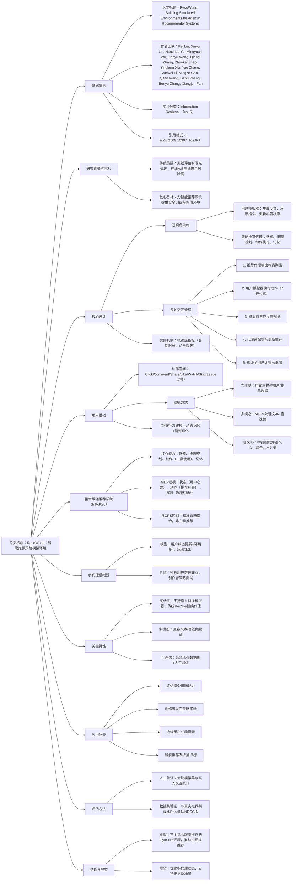

### 1. 一段话总结
Meta团队提出**RecoWorld**——首个面向**智能推荐系统（Agentic Recommender Systems）** 的模拟环境蓝图，核心是**双视角架构**：由LLM驱动的**用户模拟器**与**智能推荐代理**进行多轮交互，以最大化用户留存为目标。用户模拟器在即将脱离时生成**反思指令**（如“展示更有趣的内容”），推荐代理结合指令与推理轨迹调整推荐策略，形成动态反馈循环；该环境支持**文本、多模态、语义ID**三种用户行为建模方式，兼容多代理模拟，并提供安全的RL训练空间。RecoWorld解决了传统推荐系统离线评估的**曝光偏差**与在线A/B测试的**高风险、慢反馈**问题，可用于评估指令跟随能力、创作者策略测试等场景，为“用户指令-推荐响应”的新型交互范式奠定基础。


---


### 2. 思维导图



---


### 3. 详细总结
#### 1. 引言：研究背景与动机
传统推荐系统评估存在两大核心痛点：
- **离线评估局限**：依赖历史行为数据，存在**曝光偏差**（强化已知偏好，无法发现新兴趣）；
- **在线A/B测试缺陷**：反馈周期长、风险高，难以测试激进策略。

随着**智能推荐系统**（具备感知、推理、自主决策能力）兴起，亟需模拟环境支持安全迭代。RecoWorld应运而生，其核心目标是构建LLM驱动的模拟环境，实现：① 安全测试推荐策略；② 建模长期用户留存；③ 支持指令跟随等新型交互。


#### 2. RecoWorld核心设计
##### 2.1 双视角架构（核心创新）
RecoWorld的核心是**用户模拟器**与**智能推荐代理**的双视角交互架构，具体组成如下：

| 组件                | 核心功能                                                                 |
|---------------------|--------------------------------------------------------------------------|
| **用户模拟器**      | 1. 对推荐物品执行动作（7种：点击、评论、分享等）；<br>2. 脱离前生成反思指令；<br>3. 更新心智状态（兴趣演化）；<br>4. 输出交互轨迹作为RL奖励信号。 |
| **智能推荐代理**    | 1. 感知：检测用户状态与上下文；<br>2. 推理规划：拆解指令为检索/排序子任务；<br>3. 动作：生成更新后的推荐列表；<br>4. 记忆：存储历史交互数据。 |

##### 2.2 多轮交互流程（图1）
1. **初始推荐**：推荐代理输出物品列表；
2. **用户动作**：模拟器逐 item 执行动作（如观看20秒、跳过）；
3. **反思指令**：若用户决定脱离，生成改进指令（如“查看好友动态”）；
4. **策略适配**：代理结合指令与历史数据更新推荐列表；
5. **循环终止**：直至用户无指令退出，生成轨迹级奖励（如会话时长42秒、点击8次）。

##### 2.3 关键特性
- **灵活性**：
    - 支持“模拟器→真人”替换，转为在线实验；
    - 支持“智能代理→传统RecSys”替换，忽略指令仅用历史数据；
    - 支持关闭指令，转为单轮评估。
- **奖励信号**：聚焦**长期用户留存**（会话时长、跨会话间隔），区别于传统离线指标（NDCG仅优化即时相关性）。


#### 3. 用户模拟：行为建模与演化
##### 3.1 动作空间与决策逻辑
用户模拟器的动作空间包含7种核心行为，决策受**上下文**（时间、 demographics、社交关系）与**历史交互**双重影响，执行步骤为：① 推理行为动机；② 执行动作；③ 更新心智状态。

##### 3.2 三种用户建模方式（图2）
| 建模方式       | 原理                                                                 | 优势                                                                 | 局限                                                                 |
|----------------|----------------------------------------------------------------------|----------------------------------------------------------------------|----------------------------------------------------------------------|
| **文本基建模** | 物品/用户数据转为文本描述（如物品元数据、用户历史摘要）               | 灵活性高，支持长上下文压缩，适配LLM推理能力                           | 遗漏多模态细节（如视频情绪、音乐风格）                               |
| **多模态建模** | 用MLLM（如Qwen2.5-Omni）直接处理文本+音视频原始数据                 | 表征更丰富，捕捉多模态偏好                                           | 推理能力较弱，音视频token占用大，上下文效率低                         |
| **语义ID建模** | 物品编码为语义ID（相似内容ID相近），与LLM联合预训练                   | 兼顾推理能力与压缩效率，支持新内容更新                               | 需持续预训练融入新内容，初始训练成本高                               |

##### 3.3 终身行为建模
- **动态记忆**：智能过滤冗余历史，优先保留近期关键交互；
- **偏好演化**：通过“心智更新”捕捉兴趣迁移（如从UFC转向钓鱼内容）。


#### 4. 指令跟随推荐系统（InFoRec）
##### 4.1 核心能力（图4）
- 感知：识别用户显式指令（如“少推政治内容”）与隐式信号（如长期观看长视频）；
- 推理规划：拆解指令为子任务（如“检索旧金山用户偏好内容”）；
- 动作：调用检索/排序模块生成更新列表；
- 记忆：存储指令历史与交互反馈。

##### 4.2 与对话推荐系统（CRS）的区别
| 维度           | 指令跟随推荐系统（InFoRec）                          | 对话推荐系统（CRS）                                  |
|----------------|-----------------------------------------------------|-----------------------------------------------------|
| 核心目标       | 精准执行用户指令                                     | 主动推荐物品，引导用户兴趣                           |
| 交互模式       | “用户指令→系统响应”                                  | “对话闲聊→主动推荐”（如回答日期后推荐电影）           |
| 策略重点       | 调整物品列表（增删/重排）                             | 运用说服策略（权威、情感吸引）                       |


#### 5. 多代理模拟器
支持N个模拟用户的群体交互，用户状态更新公式为：  
$`[u_{i}(t+1)=f\left(u_{i}(t), \cup_{j \in \mathcal{N}(i)} s_{i j}(t), e(t)\right)]`$
- **应用价值**：为创作者提供群体反馈（如测试内容在“美国青少年”群体中的反响），追踪6小时至1周的传播效果；
- **群体动态**：通过社交网络定义用户邻居，模拟信息扩散、群体极化等现象。


#### 6. 应用场景（表1）
| 场景                | 描述                                                                 |
|---------------------|----------------------------------------------------------------------|
| 指令跟随能力评估    | 测试系统对自然语言指令的响应（如“推旧金山用户喜欢的内容”）             |
| 创作者策略实验      | 安全测试发布频率、内容风格等策略，避免真实用户流失                   |
| 边缘用户兴趣探索    | 结合上下文bandit算法，在模拟环境中探索新用户兴趣，无真实体验风险     |
| 智能推荐排行榜      | 提供统一API与评估平台，公平对比不同智能推荐系统                     |


#### 7. 评估方法
- **人工验证**：对比模拟器与真人的会话统计（如点击数、会话时长）；
- **数据集验证**：将模拟器优化后的推荐列表与真实ground-truth对比，用Recall@N、NDCG@N衡量。


#### 8. 结论与展望
RecoWorld填补了智能推荐系统模拟环境的空白，通过双视角架构与多轮反馈循环，解决了传统评估的核心痛点。未来方向包括优化多代理动态建模、支持更复杂的跨平台推荐场景。


---


### 4. 关键问题
#### 问题1：RecoWorld主要解决了传统推荐系统评估的哪些核心痛点？其创新思路是什么？
**答案**：  
传统推荐系统评估存在两大核心痛点：
1. **离线评估的曝光偏差**：依赖历史行为数据，强化已知偏好，无法发现新用户兴趣；
2. **在线A/B测试的局限**：反馈周期长（需等待真实用户交互）、风险高（激进策略可能导致用户流失）、成本高。

RecoWorld的创新思路是**构建LLM驱动的模拟交互环境**，核心突破在于：
- 用**双视角架构**（用户模拟器+智能推荐代理）复现真实多轮交互，生成轨迹级奖励信号（如会话时长），建模长期留存而非仅即时相关性；
- 引入**反思指令机制**，让用户模拟器在脱离时提供改进反馈，推动推荐策略迭代，解决离线评估“无反馈”问题；
- 支持**安全测试**，允许在模拟环境中验证激进策略，避免真实用户风险。


#### 问题2：RecoWorld的双视角架构具体由哪两部分组成？二者的多轮交互机制如何运作？
**答案**：  
RecoWorld的双视角架构由**用户模拟器**与**智能推荐代理**组成，多轮交互机制遵循“推荐→动作→指令→适配”循环，具体步骤如下：

1. **初始推荐**：智能推荐代理基于用户初始状态（如30岁男性，喜好深海钓鱼）输出物品列表；
2. **用户动作执行**：模拟器逐item执行动作（7种可选：点击、观看20秒、跳过等），并实时更新心智状态（如“对钓鱼内容保持开放”）；
3. **反思指令生成**：若用户决定脱离会话，模拟器基于不满生成指令（如“太多发型推荐，要不同但相关的内容”）；
4. **策略适配与更新**：智能推荐代理通过感知模块解析指令，推理模块拆解为“过滤发型内容+检索钓鱼相关衍生内容”子任务，调用排序模块生成新列表；
5. **循环与终止**：重复步骤2-4，直至用户无指令退出，交互轨迹（如点击8次、会话42秒）作为RL奖励信号用于代理训练。


#### 问题3：RecoWorld提供了三种用户建模方式，其核心差异与适用场景分别是什么？
**答案**：  
三种建模方式基于不同的物品/用户数据表征，核心差异与适用场景如下表所示：

| 建模方式       | 核心差异（表征/骨干模型）                          | 优势                                  | 局限                                  | 适用场景                                  |
|----------------|-----------------------------------------------------|---------------------------------------|---------------------------------------|-------------------------------------------|
| 文本基建模     | 物品/用户数据转为文本描述（如元数据、历史摘要）；骨干为LLaMA4等 | 灵活性高，支持长上下文压缩，适配LLM推理 | 遗漏多模态细节（如视频情绪）          | 文本为主的推荐场景（如新闻、博客）        |
| 多模态建模     | 直接输入文本+音视频；骨干为Qwen2.5-Omni等MLLM        | 捕捉多模态偏好（如视频风格、音乐情绪）  | 推理弱、token占用大、效率低            | 短视频、直播等多模态内容推荐              |
| 语义ID建模     | 物品编码为语义ID（相似内容ID相近）；与Gemini联合预训练 | 兼顾推理能力与压缩效率，支持新内容更新  | 需持续预训练，初始成本高              | 大规模内容平台（如短视频APP），需平衡效率与精度 |
```